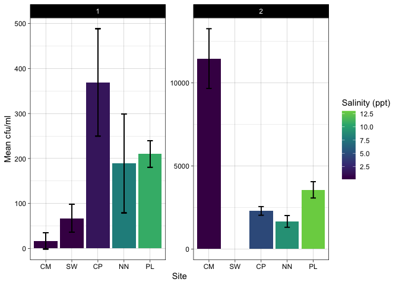

combined_phytophthora
================
Sam Muir
2023-02-16

## Plotting

#### Facet by season: Mel’s (1), mine (2)

-   My data uses counts from the second trial after 4 days incubation

``` r
ggplot(phyto_comb, aes(reorder(location, salinity), mean_cfu, fill = salinity)) +
  geom_bar(position="dodge", stat = "identity", size = 0.8) +
  facet_wrap(~season, scales = "free_y") +
  geom_errorbar(aes(ymin=mean_cfu-sd_cfu, 
                    ymax=mean_cfu+sd_cfu), 
                width=0.2, linewidth = 0.5,
                 position=position_dodge(.9)) +
  labs(x = "Site", y = "Mean cfu/ml", fill = "Salinity (ppt)") +
  theme_linedraw() +
  scale_fill_viridis_c(end = 0.8)
```

    ## Warning: Using `size` aesthetic for lines was deprecated in ggplot2 3.4.0.
    ## ℹ Please use `linewidth` instead.

<!-- -->

## Statistical Analysis

ANOVA (location + season)

``` r
aovcomb <- aov(cfu_ml ~ location+season, phyto_comb)
summary(aovcomb)
```

    ##             Df    Sum Sq   Mean Sq F value   Pr(>F)    
    ## location     4  47695863  11923966   3.999  0.00658 ** 
    ## season       1 189379492 189379492  63.516 1.25e-10 ***
    ## Residuals   53 158025743   2981618                     
    ## ---
    ## Signif. codes:  0 '***' 0.001 '**' 0.01 '*' 0.05 '.' 0.1 ' ' 1

``` r
TukeyHSD(aovcomb)
```

    ##   Tukey multiple comparisons of means
    ##     95% family-wise confidence level
    ## 
    ## Fit: aov(formula = cfu_ml ~ location + season, data = phyto_comb)
    ## 
    ## $location
    ##             diff       lwr        upr     p adj
    ## CP-CM -1844.6154 -3757.191   67.96019 0.0636930
    ## NN-CM -2129.2308 -4041.806 -216.65519 0.0219728
    ## PL-CM -1442.2308 -3493.240  608.77804 0.2869866
    ## SW-CM -2592.2308 -4643.240 -541.22196 0.0066314
    ## NN-CP  -284.6154 -2197.191 1627.96019 0.9932846
    ## PL-CP   402.3846 -1648.624 2453.39342 0.9809685
    ## SW-CP  -747.6154 -2798.624 1303.39342 0.8406581
    ## PL-NN   687.0000 -1364.009 2738.00881 0.8775269
    ## SW-NN  -463.0000 -2514.009 1588.00881 0.9682085
    ## SW-PL -1150.0000 -3330.672 1030.67167 0.5739015
    ## 
    ## $season
    ##         diff      lwr     upr p adj
    ## 2-1 4324.309 3204.127 5444.49     0
