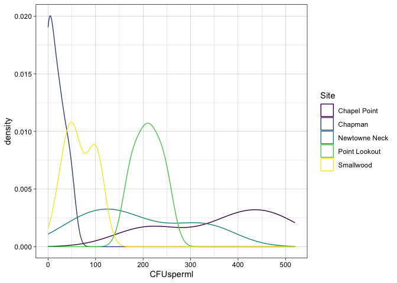
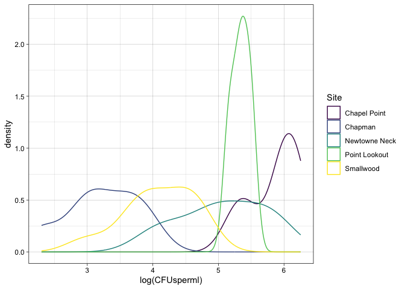
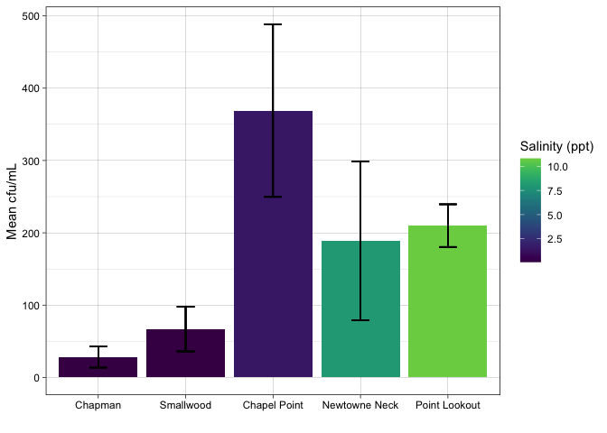
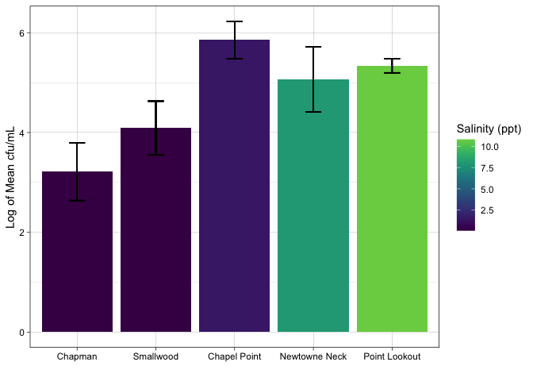

phyto_mel
================
Sam Muir
2023-02-16

## Initial data plotting

<!-- -->

    ## Warning: Removed 4 rows containing non-finite values (`stat_density()`).

<!-- -->

## Plotting Averages

``` r
ggplot(avg_mel, aes(reorder(Site, Salinity), mean_cfu, fill = Salinity)) +
  geom_bar(position="dodge", stat = "identity", size = 0.8) +
  geom_errorbar(aes(ymin=mean_cfu - sd_cfu, 
                    ymax= mean_cfu + sd_cfu), 
                width=0.2, linewidth = 0.5,
                 position=position_dodge(.9)) +
  theme_linedraw() +
  labs(x = "", y = "Mean cfu/mL", fill = "Salinity (ppt)") +
  scale_fill_viridis(end = 0.8)
```

    ## Warning: Using `size` aesthetic for lines was deprecated in ggplot2 3.4.0.
    ## ℹ Please use `linewidth` instead.

<!-- -->

Log transformed

``` r
ggplot(avg_log_mel, aes(reorder(Site, Salinity), mean_log, fill = Salinity)) +
  geom_bar(position="dodge", stat = "identity", size = 0.8) +
  geom_errorbar(aes(ymin=mean_log - sd_log, 
                    ymax= mean_log + sd_log), 
                width=0.2, linewidth = 0.5,
                 position=position_dodge(.9)) +
  theme_linedraw() +
  labs(x = "", y = "Log of Mean cfu/mL", fill = "Salinity (ppt)") +
  scale_fill_viridis(end = 0.8)
```

<!-- -->

## Statistical Analysis

### Log transformed data

Levene’s Test

``` r
leveneTest(log_cfu ~ Site, avg_log_mel)
```

    ## Warning in leveneTest.default(y = y, group = group, ...): group coerced to
    ## factor.

    ## Levene's Test for Homogeneity of Variance (center = median)
    ##       Df F value Pr(>F)  
    ## group  4   2.399  0.067 .
    ##       38                 
    ## ---
    ## Signif. codes:  0 '***' 0.001 '**' 0.01 '*' 0.05 '.' 0.1 ' ' 1

ANOVA

``` r
aov <- aov(log_cfu ~ Site, avg_log_mel)
summary(aov)
```

    ##             Df Sum Sq Mean Sq F value   Pr(>F)    
    ## Site         4  33.95   8.488   33.78 4.86e-12 ***
    ## Residuals   38   9.55   0.251                     
    ## ---
    ## Signif. codes:  0 '***' 0.001 '**' 0.01 '*' 0.05 '.' 0.1 ' ' 1

Tukey Test

``` r
TukeyHSD(aov)
```

    ##   Tukey multiple comparisons of means
    ##     95% family-wise confidence level
    ## 
    ## Fit: aov(formula = log_cfu ~ Site, data = avg_log_mel)
    ## 
    ## $Site
    ##                                   diff        lwr        upr     p adj
    ## Chapman-Chapel Point        -2.6377291 -3.3788039 -1.8966544 0.0000000
    ## Newtowne Neck-Chapel Point  -0.7887489 -1.4305385 -0.1469594 0.0094957
    ## Point Lookout-Chapel Point  -0.5151958 -1.2224135  0.1920218 0.2471689
    ## Smallwood-Chapel Point      -1.7652707 -2.4070602 -1.1234811 0.0000000
    ## Newtowne Neck-Chapman        1.8489802  1.1079055  2.5900549 0.0000002
    ## Point Lookout-Chapman        2.1225333  1.3241257  2.9209409 0.0000000
    ## Smallwood-Chapman            0.8724585  0.1313837  1.6135332 0.0140872
    ## Point Lookout-Newtowne Neck  0.2735531 -0.4336645  0.9807707 0.8015834
    ## Smallwood-Newtowne Neck     -0.9765218 -1.6183113 -0.3347322 0.0008732
    ## Smallwood-Point Lookout     -1.2500749 -1.9572925 -0.5428572 0.0001028
