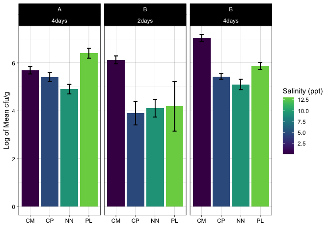

Phytophthora
================
Sam Muir
2022-12-16

## Initial data cleaning and plotting

I filtered the data to only include the counts after 4 days for both
trials, as well as only including the 10-1 dilution. Then, I plotted the
data to check for normal distribution. The data appears to be skewed.
<!-- -->

Log transforming the data shows a more normal distribution for some of
them? Newtowne Neck is still skewed.

<!-- -->

## Plotting Averages

Non-transformed data:  
- Letter indicates trial (1st or second)  
- days is incubation time

``` r
ggplot(phyto_avg, aes(location, mean_cfu, fill = salinity_ppt)) +
  geom_bar(position="dodge", stat = "identity", size = 0.8) +
  facet_wrap(~trial + incubation) +
  geom_errorbar(aes(ymin=mean_cfu-sd_cfu, 
                    ymax=mean_cfu+sd_cfu), 
                width=0.2, linewidth = 0.5,
                 position=position_dodge(.9)) +
  theme_linedraw() +
  labs(x = "", y = "Mean cfu/g", fill = "Salinity (ppt)") +
  scale_fill_viridis(end = 0.8)
```

    ## Warning: Using `size` aesthetic for lines was deprecated in ggplot2 3.4.0.
    ## ℹ Please use `linewidth` instead.

<!-- -->

Log Transformed Data:  
- Letter indicates trial (1st or second)  
- days is incubation time

``` r
ggplot(phyto_log, aes(location, mean_log_cfu, fill = salinity_ppt)) +
  geom_bar(position="dodge", stat = "identity", size = 0.8) +
  facet_wrap(~trial+incubation) +
  geom_errorbar(aes(ymin=mean_log_cfu-sd_log_cfu, 
                    ymax=mean_log_cfu+sd_log_cfu), 
                width=0.2, linewidth = 0.5,
                 position=position_dodge(.9)) +
  theme_linedraw() +
  labs(x = "", y = "Log of Mean cfu/g", fill = "Salinity (ppt)") +
  scale_fill_viridis(end = 0.8)
```

<!-- -->

## Statistical Analysis - Log-transformed data

### For after 4 days incubation

Levene’s Test

``` r
leveneTest(log_cfu ~ location, filter_aov)
```

    ## Warning in leveneTest.default(y = y, group = group, ...): group coerced to
    ## factor.

    ## Levene's Test for Homogeneity of Variance (center = median)
    ##       Df F value Pr(>F)
    ## group  3  0.2085 0.8877
    ##        8

ANOVA

``` r
aov <- aov(log_cfu ~ location, filter_aov)
summary(aov)
```

    ##             Df Sum Sq Mean Sq F value   Pr(>F)    
    ## location     3  6.430   2.143    82.5 2.34e-06 ***
    ## Residuals    8  0.208   0.026                     
    ## ---
    ## Signif. codes:  0 '***' 0.001 '**' 0.01 '*' 0.05 '.' 0.1 ' ' 1

Tukey Test

``` r
TukeyHSD(aov)
```

    ##   Tukey multiple comparisons of means
    ##     95% family-wise confidence level
    ## 
    ## Fit: aov(formula = log_cfu ~ location, data = filter_aov)
    ## 
    ## $location
    ##             diff         lwr         upr     p adj
    ## CP-CM -1.6029550 -2.02439509 -1.18151497 0.0000090
    ## NN-CM -1.9362105 -2.35765057 -1.51477046 0.0000022
    ## PL-CM -1.1667271 -1.58816717 -0.74528705 0.0000959
    ## NN-CP -0.3332555 -0.75469554  0.08818457 0.1285062
    ## PL-CP  0.4362279  0.01478786  0.85766798 0.0427013
    ## PL-NN  0.7694834  0.34804335  1.19092346 0.0017223

### For after 2 days incubation

Levene’s Test

``` r
leveneTest(log_cfu ~ location, filter_aov2)
```

    ## Warning in leveneTest.default(y = y, group = group, ...): group coerced to
    ## factor.

    ## Levene's Test for Homogeneity of Variance (center = median)
    ##       Df F value Pr(>F)
    ## group  3  0.4252 0.7403
    ##        8

ANOVA

``` r
aov2 <- aov(log_cfu ~ location, filter_aov2)
summary(aov2)
```

    ##             Df Sum Sq Mean Sq F value  Pr(>F)   
    ## location     3  9.727   3.242   8.804 0.00648 **
    ## Residuals    8  2.946   0.368                   
    ## ---
    ## Signif. codes:  0 '***' 0.001 '**' 0.01 '*' 0.05 '.' 0.1 ' ' 1

Tukey Test

``` r
TukeyHSD(aov2)
```

    ##   Tukey multiple comparisons of means
    ##     95% family-wise confidence level
    ## 
    ## Fit: aov(formula = log_cfu ~ location, data = filter_aov2)
    ## 
    ## $location
    ##              diff       lwr        upr     p adj
    ## CP-CM -2.23131435 -3.818052 -0.6445772 0.0086064
    ## NN-CM -2.02326292 -3.610000 -0.4365257 0.0148983
    ## PL-CM -1.93949144 -3.526229 -0.3527543 0.0186895
    ## NN-CP  0.20805144 -1.378686  1.7947886 0.9734779
    ## PL-CP  0.29182291 -1.294914  1.8785601 0.9326421
    ## PL-NN  0.08377148 -1.502966  1.6705086 0.9981348
