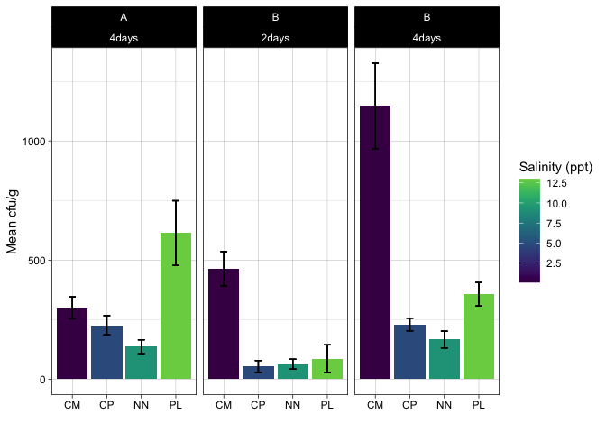

Phytophthora
================
Sam Muir
2022-12-16

## Initial data cleaning and plotting

I filtered the data to only include the counts after 4 days for both
trials, as well as only including the 10-1 dilution. Then, I plotted the
data to check for normal distribution. The data appears to be skewed.
<!-- -->

Log transforming the data shows a more normal distribution for some of
them? Newtowne Neck is still skewed.

<!-- -->

## Plotting Averages

``` r
ggplot(averages, aes(location, `mean(log_cfu)`, fill = salinity_ppt)) +
  geom_bar(position="dodge", stat = "identity", size = 0.8) +
  geom_errorbar(aes(ymin=`mean(log_cfu)`-`sd(log_cfu)`, 
                    ymax=`mean(log_cfu)`+`sd(log_cfu)`), 
                width=0.2, linewidth = 0.5,
                 position=position_dodge(.9)) +
  theme_linedraw() +
  scale_x_discrete(labels=c("CM" = "Chapman", "CP" = "Chapel Point",
                              "NN" = "Newtowne Neck", "PL" = "Point Lookout")) +
  labs(x = "", y = "Log of Mean cfu/g", fill = "Salinity (ppt)") +
  scale_fill_viridis(end = 0.8)
```

    ## Warning: Using `size` aesthetic for lines was deprecated in ggplot2 3.4.0.
    ## ℹ Please use `linewidth` instead.

<!-- -->

## Statistical Analysis

Levene’s Test

``` r
leveneTest(log_cfu ~ location, averages)
```

    ## Warning in leveneTest.default(y = y, group = group, ...): group coerced to
    ## factor.

    ## Levene's Test for Homogeneity of Variance (center = median)
    ##       Df F value    Pr(>F)    
    ## group  3   26.53 3.569e-07 ***
    ##       20                      
    ## ---
    ## Signif. codes:  0 '***' 0.001 '**' 0.01 '*' 0.05 '.' 0.1 ' ' 1

Since p \> 0.05 there is equal variance and we can perform an ANOVA.

ANOVA

``` r
aov <- aov(log_cfu ~ location, averages)
summary(aov)
```

    ##             Df Sum Sq Mean Sq F value   Pr(>F)    
    ## location     3  7.167  2.3889   12.97 6.25e-05 ***
    ## Residuals   20  3.683  0.1841                     
    ## ---
    ## Signif. codes:  0 '***' 0.001 '**' 0.01 '*' 0.05 '.' 0.1 ' ' 1

Tukey Test

``` r
TukeyHSD(aov)
```

    ##   Tukey multiple comparisons of means
    ##     95% family-wise confidence level
    ## 
    ## Fit: aov(formula = log_cfu ~ location, data = averages)
    ## 
    ## $location
    ##             diff         lwr        upr     p adj
    ## CP-CM -0.9433275 -1.63676515 -0.2498899 0.0055904
    ## NN-CM -1.3641381 -2.05757568 -0.6707005 0.0001189
    ## PL-CM -0.2293873 -0.92282486  0.4640504 0.7914449
    ## NN-CP -0.4208105 -1.11424814  0.2726271 0.3504202
    ## PL-CP  0.7139403  0.02050268  1.4073779 0.0421714
    ## PL-NN  1.1347508  0.44131322  1.8281884 0.0009629
